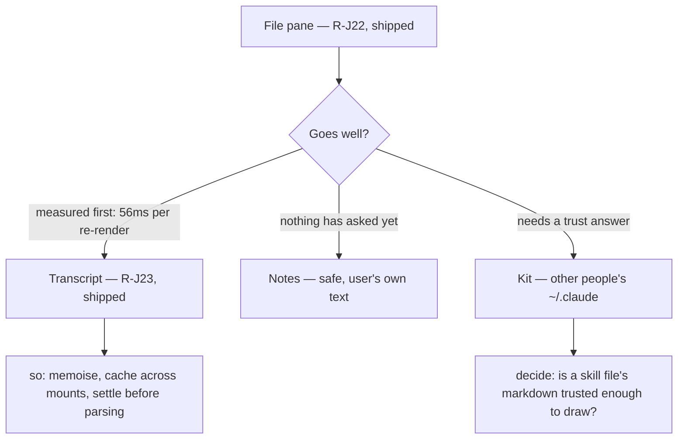

# 0034 — Mermaid in the file pane, then the Transcript

A ```mermaid fence is drawn, not printed — in a file (`R-J22`), and then in the
conversation (`R-J23`), once the cost of the second had been measured.

## Spec

### Problem

Asked 2026-08-08: *"for the file viewer is that possible to view md file as
well as mermaid chat?"*

Half of it already existed. `R-B29` shipped the markdown preview — the eye
icon on a `.md` file — and `R-B38` gave it a find that searches the rendered
text and hands you back the source line. What did not exist was mermaid: a
fence rendered as a code block, so you read the diagram's source instead of
the diagram.

### Scope, and why it is this narrow

Scoped down by the same message that asked for it: *"I will further limit the
scope to play safe and only do that for the file-pane for now."* The Transcript
followed as `R-J23` once its cost had been measured rather than guessed.

Markdown is rendered in **four** places, and this covers two:

| surface | mermaid | why |
|---|---|---|
| File pane | **yes** (`R-J22`) | The ask, and the easiest thing to reason about — a file sits still while you read it |
| Transcript | **yes** (`R-J23`) | Where the value is. Shipped second, and only after the measurement below |
| Notes | not yet | Safest of the remaining two; the user's own writing, and nothing has asked for it |
| Kit | not yet | `~/.claude` skills and memory — the least controlled input in the product |

`Mermaid` is deliberately unaware of which surface it is mounted in, so each of
the remaining two is a one-line change at the call site. **That does not make
it a chore** — the Transcript was also "a one-line change", and it turned out
to need three guarantees behind it. What each still owes an answer to is below.

### Before extending it — the conditions

The diagram this feature draws, drawn by this feature:



- **Transcript — answered, and it was a memoisation problem.** The measurement
  came back at **~56ms per re-render** and ~96ms for the first draw. Fine for a
  file that sits still; not fine for a pane that re-renders as a session
  speaks, is virtualised (scrolling unmounts and remounts turns), and whose
  last turn *grows a character at a time*. So `R-J23` is three guarantees
  rather than a second call site — see below. The prediction in this row was
  right, which is the reason it was written down before the code.
- **Kit.** Skill and memory files come from `~/.claude`, which may hold skills
  the user installed rather than wrote. `securityLevel: "strict"` is what makes
  that survivable and it is already on; what is unanswered is whether drawing
  a stranger's diagram is a thing this product should do at all.
- **Notes.** No open question — it is the user's own writing, and the
  dependency is already paid for. It waits only because nothing has asked.

### What `R-J23` had to add

Three properties, each written as the thing it prevents, and each with a test:

- **Memoised on `(chart, theme)`.** The Transcript already memoises a whole
  `Turn`, which stops an events tick re-parsing turns that did not change.
  This is the other half: when a turn *does* re-render — a note edited, a
  highlight moved — the diagram inside it must not be re-parsed for a reason
  that has nothing to do with the diagram.
- **Rendered SVG cached across mounts**, keyed by resolved theme and chart,
  bounded at 40 entries with oldest-first eviction. This is the virtualiser's
  case: without it, every scroll past a diagram is another 56ms, so the pane
  would get slower the more of them you had passed.
- **A *changing* chart waits for quiet** (400ms). A streaming answer's fence is
  incomplete for as long as it takes to type, and every intermediate state is
  both a failed parse and 56ms nobody owes. Deliberately keyed on the **chart**
  and not the cache key: a theme flip also changes the key, and it is a
  discrete thing the user just did — debouncing that would leave a dark diagram
  in a light pane for the one moment the delay would be seen.

And a consequence worth naming: a diagram that has drawn once **keeps its
drawing** when a later edit stops parsing, with the failure said quietly above
it. Replacing a good diagram with a red box on every keystroke is worse than
being a moment out of date. A diagram that has *never* drawn still gets the
error and its source, which is the file-pane behaviour `R-J22` shipped.

### How it works

- **Lazily imported.** `mermaid` is 83 MB installed and carries d3 and dagre —
  comfortably the largest dependency in the window. The `import()` sits inside
  the component's effect, so a markdown file with no diagram in it pays
  nothing, which is nearly every markdown file. This repo has refused
  dependencies for less (`R-B36` turned down `rg` and `fzf`), so the cost is
  written down where it is paid.
- **`securityLevel: "strict"`, pinned by a test.** The SVG is injected with
  `dangerouslySetInnerHTML`; strict mode is what sanitises it and refuses
  click handlers and inline HTML. Asserted rather than trusted, so a future
  default that moves fails loudly.
- **Themed with the app.** Dark unless the desktop says otherwise — the same
  resolution `monacoTheme` and the terminal already use, and a theme flip
  re-renders the diagram rather than leaving it black-on-black.
- **Degrades, never panics.** A diagram that does not parse shows the parser's
  first line and the source verbatim. A half-typed diagram is the normal state
  of a file you are editing, and it must not cost you the pane.
- **Only the fence.** react-markdown's `code` component fires for inline spans
  too; an inline `` `mermaid` `` is a word, not a diagram, and the
  `language-mermaid` class is what tells them apart.

## Files touched

| Path | Change |
|---|---|
| `desktop/src/ui/Mermaid.tsx` | New. Lazy import, theme, sanitiser, error fallback; then `R-J23`'s memo, cache and settle |
| `desktop/src/panes/FilePane.tsx` | The preview routes `language-mermaid` fences to it |
| `desktop/src/panes/TranscriptPane.tsx` | `R-J23` — the same routing, with `theme` threaded through the memoised `Turn` |
| `desktop/package.json` | `mermaid@^11.16.1` |

## Test strategy

`FilePane.mermaid.test.tsx`, with mermaid itself mocked — it measures real text
in a real layout engine and jsdom has neither, so what is tested is everything
around it: a fence routed to the renderer, an ordinary fence left alone, an
inline span not mistaken for one, a diagram that fails giving back its source
rather than throwing, the theme resolved, and **`securityLevel: "strict"`
asserted**, which is the one that is a security property rather than a
behaviour.

`Mermaid.test.tsx` owns `R-J23`'s three guarantees: unrelated content changing
around a diagram does not re-parse it, an unmount and remount is served from
cache, a chart still changing is parsed once after it settles, a theme flip
redraws **at once**, and a failed edit keeps the last good drawing.

**The Transcript pane itself is not mounted by any test**, and that is stated
rather than hidden: its virtualiser measures a container jsdom gives no height,
so it renders no rows at all — a test around it would assert nothing while
looking thorough. What is asserted is the component carrying the guarantee,
driven the way that pane drives it.

Not covered by a test either: nothing here proves a diagram actually *draws*.
That needs a real layout engine, and the check was a human one — this document,
opened in the pane, in both themes.
